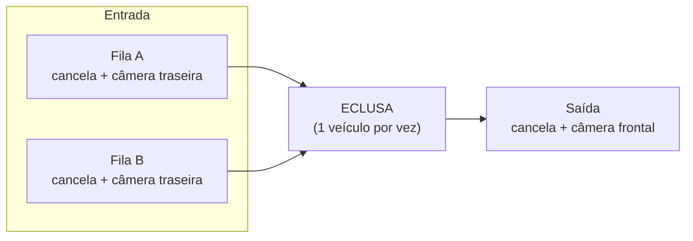
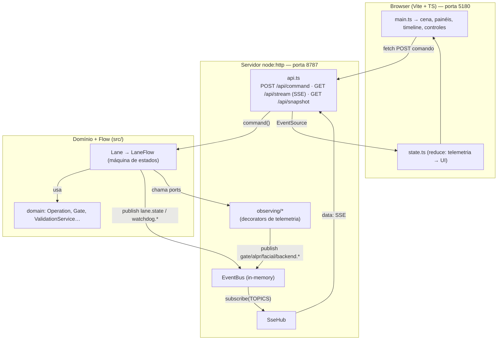
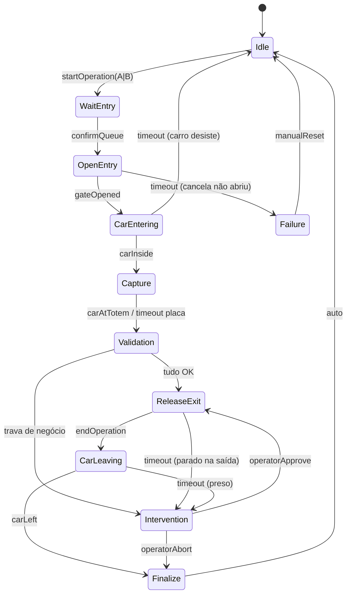
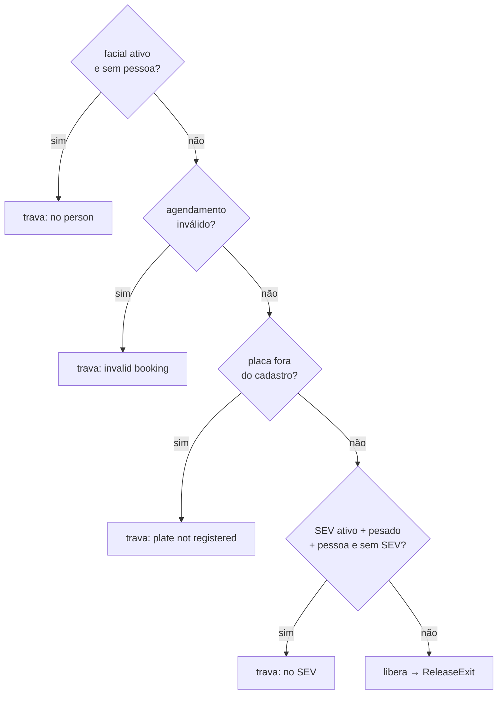
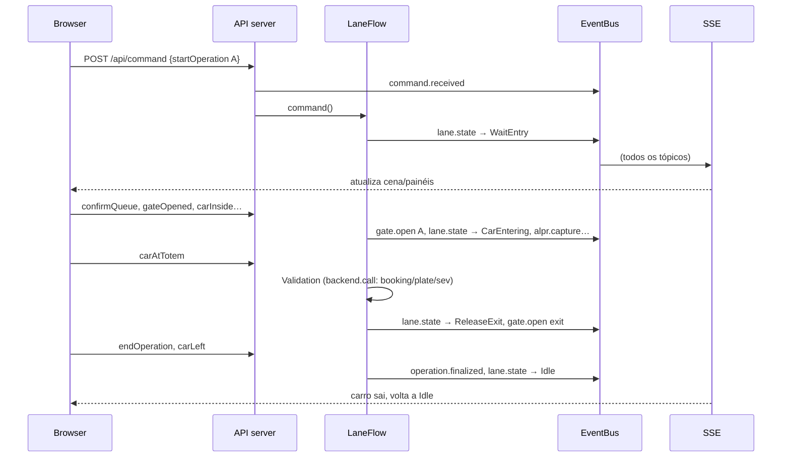

# LaneFlow — Eclusa de Acesso (estudo de máquina de estados)

Simulação, em memória, de uma **eclusa** (air-lock) de acesso veicular de recinto aduaneiro, com 3
cancelas (2 de entrada, lados **A/B** + 1 de **saída**), implementada com **State Pattern** em
TypeScript, mais um **front em tempo real** que visualiza as operações e interage com as classes.

Nada é real: não há banco, Redis ou fila. As integrações (cancela/CLP, ALPR, facial, backend
Recintos/SEV, barramento de eventos) são **emuladas em memória** respeitando as interfaces.

---

## 1. Visão geral

Um veículo chega numa das filas (A ou B). A cancela daquele lado abre, o carro entra na eclusa, a
cancela fecha. O sistema lê placa (ALPR), pessoa (facial) e peso, consulta o backend
(agendamento → placa no cadastro → SEV) e decide: **libera a saída** ou **pede intervenção do
operador**. Só existe **uma operação por vez** (invariante da eclusa); um novo início só é aceito
quando a lane volta a `Idle`.



---

## 2. Arquitetura

O domínio não conhece HTTP nem o navegador. O servidor injeta na `Lane` os ports **decorados**
(`Observing*`), que publicam telemetria num `EventBus`; o servidor reencaminha cada mensagem do bus
por **SSE** ao navegador, que reduz o stream a um estado de UI e desenha a cena.



**Camadas (`src/`)**: `domain/` = substantivos + regras puras (o *que*); `flow/` = verbos no tempo,
a máquina de estados (o *como* a operação progride). O `flow` usa o `domain`; o `domain` não conhece
o `flow`.

---

## 3. Máquina de estados (flow)

Cada estado é uma classe (`flow/states/`) com `onEnter` (ação ao entrar) + `handle(evento)`
(decide o próximo). `LaneFlow` é o motor (transição, dispatch, watchdog, captura de falha).



Dois baldes de erro: **técnico → `Failure`** (cancela não abre, etc.; via `fail`/watchdog) e
**negócio → `Intervention`** (regras reprovam). De `Failure`/`Intervention` nunca pula direto pra
nova operação — sempre passa por `Idle`.

### Regras de validação (domain `ValidationService`)

Pipeline com short-circuit; checks inativos por config = pass automático:



A placa da operação é a de **maior confiança** (não a primeira lida); o tipo `Plate` carrega
`position` (front/rear) e `unit` (tractor/trailer) — moto tem só traseira e não quebra o fluxo.

---

## 4. Fluxo de uma operação (happy path)



---

## 5. Telemetria (tópicos do EventBus)

| Tópico | Origem | Payload |
|---|---|---|
| `command.received` | servidor | `{ laneId, event }` |
| `lane.state` | LaneFlow | `{ state, operationId }` |
| `watchdog.arm` / `watchdog.clear` | LaneFlow | `{ ms? }` |
| `gate.open` / `gate.close` / `gate.state` | ObservingCommandGate | `{ gate: A\|B\|exit, result }` |
| `alpr.capture` / `alpr.stop` | ObservingAlpr | `{ camera? }` |
| `facial.start` / `facial.stop` | ObservingFacial | `{}` |
| `backend.call` | ObservingBackend | `{ method, input, result, ms }` |
| `operation.finalized` | Finalize | `{ id, side, durationMs }` |
| `operator.intervention` | Intervention | `{ operationId, reason }` |
| `lane.failure` | Failure | `{ operationId, reason }` |

Único toque no domínio para telemetria: `LaneFlow` publica `lane.state` e `watchdog.*` (via
`deps.bus?.publish`). O resto vem dos decorators, que ficam fora do domínio (`server/observing/`).

---

## 6. Estrutura de arquivos

```
src/                  domínio + máquina de estados (backend puro, zero-dep)
  domain/             Operation, Gate, Lane, LaneRegistry, ValidationService, EntryQueueService, types
  flow/               LaneFlow (motor) + LaneTwoEntriesOneExit (topologia) + states/ (11 estados)
  integrations/       interfaces (ports) + emulações em memória (Fake*)
  LaneController.ts   controller fino (comando por id)
  index.ts            demo de linha de comando (1 ciclo, imprime estados)
server/               servidor node:http + SSE
  observing/          decorators de telemetria
  sse.ts api.ts index.ts
web/                  front Vite + TypeScript
  src/                main, scene, panels, timeline, controls, state, scenarios, api, types, styles
docs/superpowers/     specs e planos de implementação
```

---

## 7. Como rodar

Requisitos: **Node.js 22+** e npm.

```bash
npm install
```

### Front em tempo real (recomendado)

```bash
npm run front     # sobe API (8787) + Vite (5180)
```

Abra **http://localhost:5180** (a página é o Vite; `8787` é só a API). O Vite faz proxy de `/api/*`
para o servidor Node.

Dois terminais separados, se preferir:

```bash
npm run server    # API + SSE em http://localhost:8787
npm run web        # front em http://localhost:5180
```

Na tela: cena animada (filas A/B → eclusa → saída), painéis **Sensores**/**Integrações**,
**Timeline** ao vivo e **Controles**:
- **Cenários**: `Happy path`, `Happy path B`, `Alternar A↔B`, `Sem pessoa` (trava), `Carro desiste`.
- **Controle manual**: um botão por evento.
- **Dados**: `plateRead`, `personDetected`, `weightMeasured`.
- **Painel de ação** (aparece em Intervention/Failure): **Liberar carro** / **Abortar** / **Reset**.

> Reiniciar o servidor zera o estado (tudo em memória). O front re-sincroniza ao reconectar.

### Demo no terminal (sem front)

```bash
npm run dev       # roda 1 ciclo e imprime as transições; termina em "carLeft -> state: Idle"
```

---

## 8. Scripts

| Script | O que faz |
|---|---|
| `npm run front` | servidor + front juntos |
| `npm run server` | API + SSE (`server/index.ts`) em watch |
| `npm run web` | front Vite (`vite web`) |
| `npm run dev` | demo CLI (`src/index.ts`) em watch |
| `npm test` | testes do backend + servidor (`node:test` via tsx) |
| `npm run typecheck` | typecheck do domínio (`src/`) |
| `npm run build` | compila `src/` para `dist/` |

Testes do front e typechecks extras:

```bash
node --import tsx --test "web/src/**/*.test.ts"   # reducer de UI + cenários
npx tsc --noEmit -p server/tsconfig.json          # typecheck do servidor
npx tsc --noEmit -p web/tsconfig.json             # typecheck do front
```

---

## 9. Documentação

- Spec do backend: `docs/superpowers/specs/2026-05-29-laneflow-design.md`
- Spec do front: `docs/superpowers/specs/2026-05-29-laneflow-front-design.md`
- Planos de implementação: `docs/superpowers/plans/`
