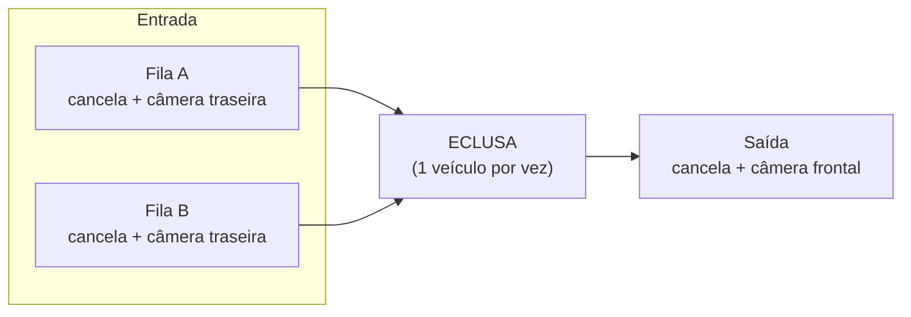
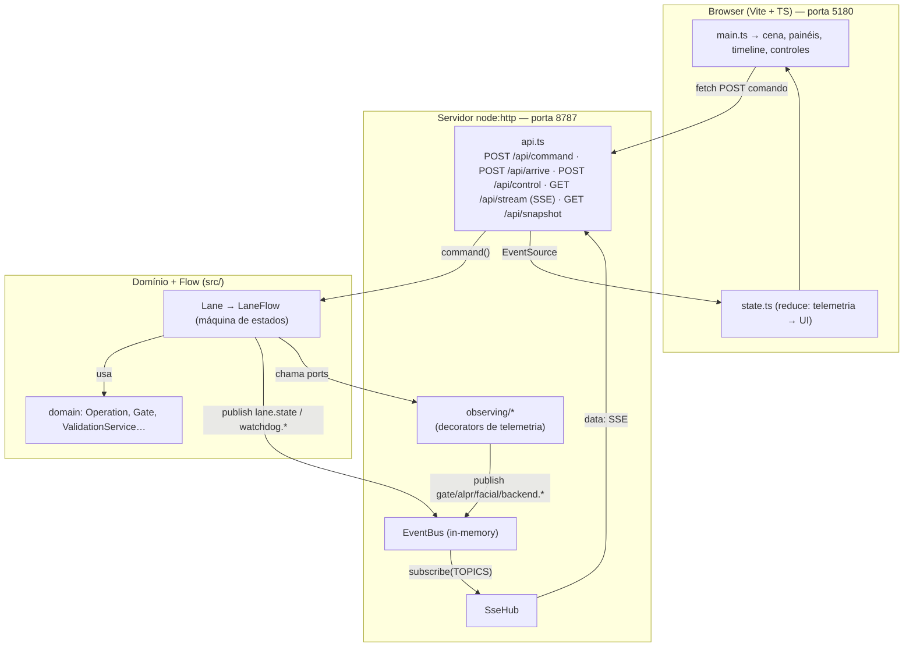
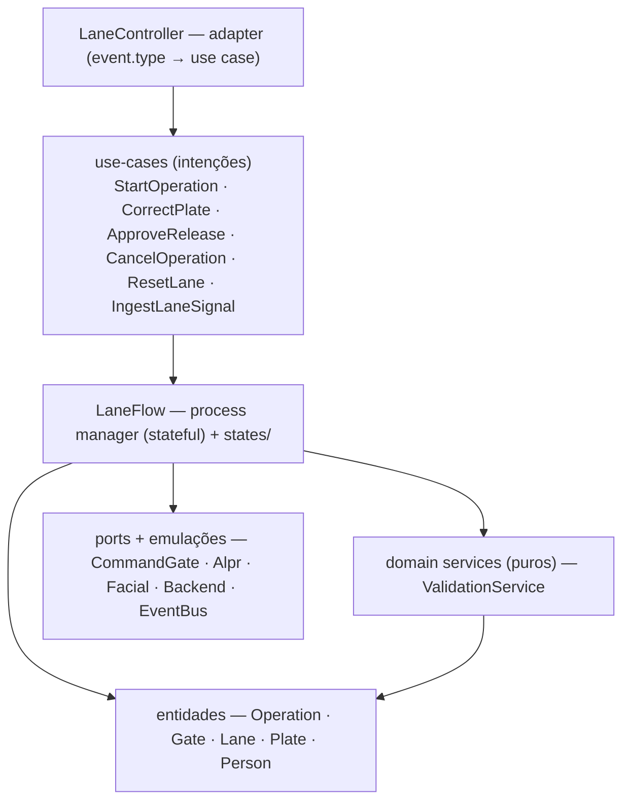
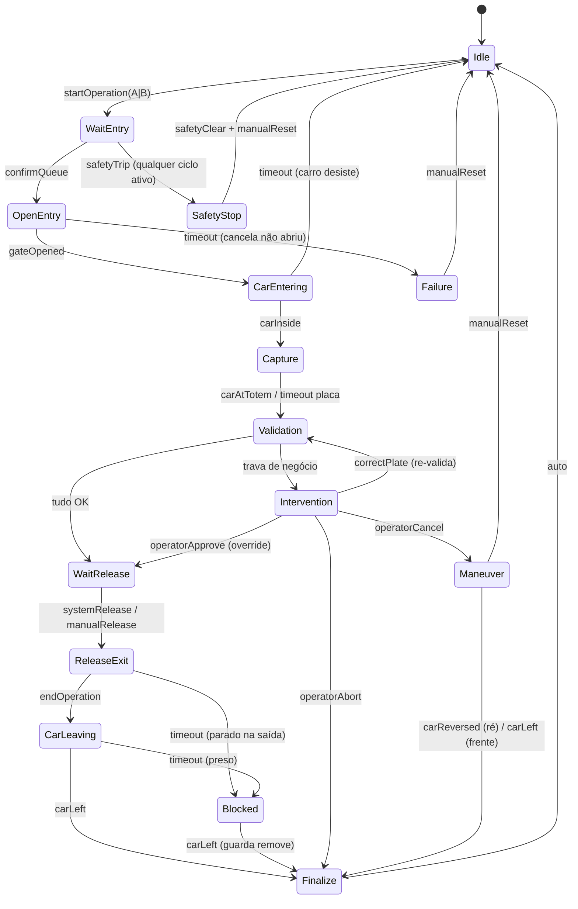
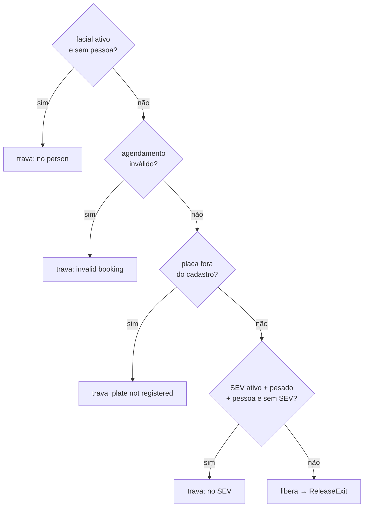
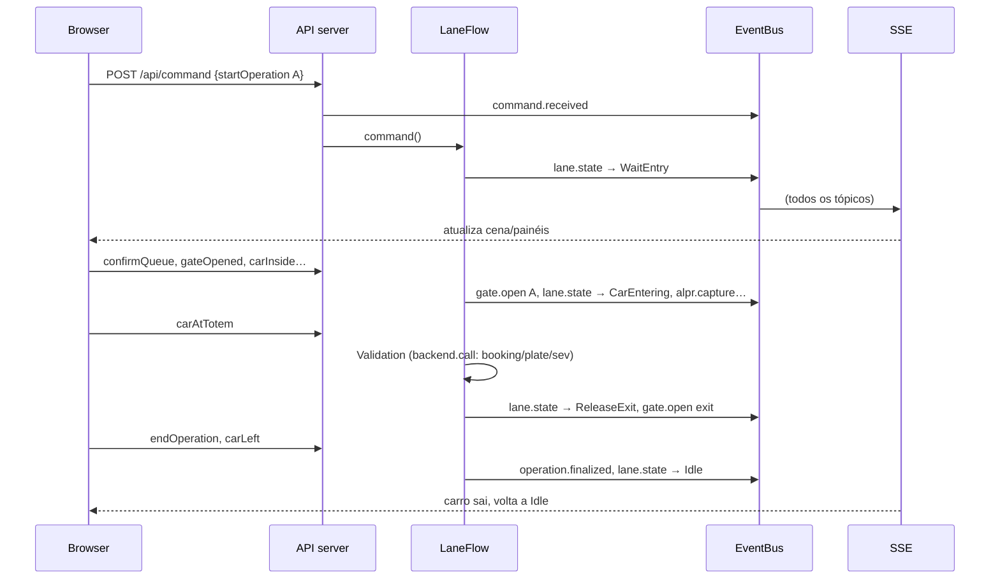
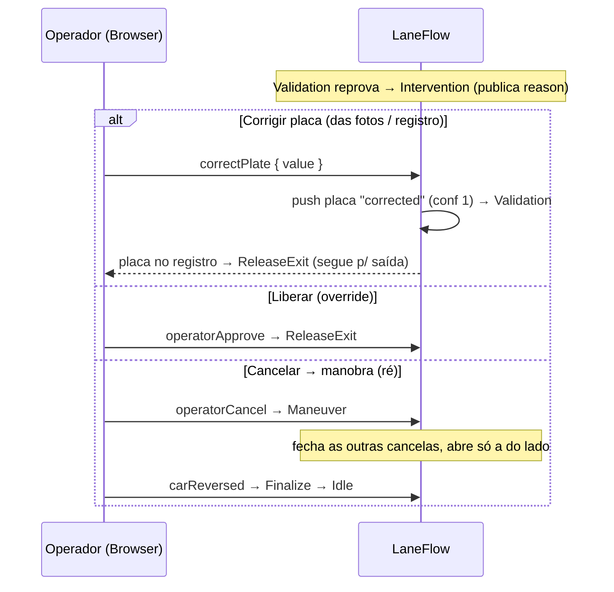

# LaneFlow — Eclusa de Acesso (estudo de máquina de estados)

Simulação, em memória, de uma **eclusa** (air-lock) de acesso veicular de recinto aduaneiro, com 3
cancelas (2 de entrada, lados **A/B** + 1 de **saída**), implementada com **State Pattern** em
TypeScript, mais um **front em tempo real** que visualiza as operações e interage com as classes.

Nada é real: não há banco, Redis ou fila. As integrações (cancela/CLP, ALPR, facial, backend
Recintos/SEV, barramento de eventos) são **emuladas em memória** respeitando as interfaces.

---

## 1. Visão geral

Um veículo chega numa das filas (A ou B). A cancela daquele lado abre, o carro entra na eclusa, a
cancela fecha. O sistema lê placa (ALPR), pessoa (facial) e peso, consulta o backend
(agendamento → placa no cadastro → SEV) e decide: **libera a saída** ou **pede intervenção do
operador**. Só existe **uma operação por vez** (invariante da eclusa); um novo início só é aceito
quando a lane volta a `Idle`.



### Máquina de estados dupla: CLP (físico) × código (negócio)

O comportamento da pista vive em **duas máquinas de estado coordenadas**, cada uma com sua responsabilidade:

- **CLP — camada física (PLC simulado: `EntrySensorPort`/`FakeClp`)** é a **fonte de verdade do estado físico**: a fila de chegadas (FIFO global entre A/B por `seq`), o **modo de operação** da pista (`operation` / `maintenance` / `maneuver` / `emergency`, precedência **Emergência > Manutenção > Manobra > Operação**) e a **segurança** (anti-esmagamento). A CLP **sequencia o início autonomamente** (puxa a próxima chegada quando ociosa, só com `safetyOk` e em `operation`), mas **nunca decide a liberação** no ponto de regra de negócio — sempre aguarda um comando explícito.
- **Código — `LaneFlow`** é a máquina de **software**: o ciclo por-operação (estados em `states/`), as **decisões de negócio** (validação Recintos/SEV) e o **ponto de liberação** (`WaitRelease`), onde a cancela de saída só abre por **`systemRelease`** (sistema) ou **`manualRelease`** (botoeira).

As duas conversam por **sinais/telemetria**: a CLP reporta chegadas (`vehicleArrived` → `entry.arrived`) e mantém modo/segurança; o `LaneFlow` consome esses sinais, roda o ciclo e devolve telemetria de estado (`lane.state`, `lane.mode`, `lane.safety`, …). Decisões registradas em **`docs/adr/`** — ADR-0001 (modelo operacional: modos, autoridade de liberação, segurança), ADR-0002 (protocolo de campo: Modbus primário, OPC-UA secundário), ADR-0003 (recuperação durável, CLP como fonte de verdade).

---

## 2. Arquitetura

O domínio não conhece HTTP nem o navegador. O servidor injeta na `Lane` os ports **decorados**
(`Observing*`), que publicam telemetria num `EventBus`; o servidor reencaminha cada mensagem do bus
por **SSE** ao navegador, que reduz o stream a um estado de UI e desenha a cena.



**Camadas (`src/`)**: `domain/` = substantivos + regras puras (o *que*); `flow/` = verbos no tempo,
a máquina de estados (o *como* a operação progride). O `flow` usa o `domain`; o `domain` não conhece
o `flow`.



Distinção: **adapter** (sem regra) → **use case** (uma intenção) → **process manager** (`LaneFlow`,
stateful) ≠ **domain service** (puro, stateless). Cada seta é "depende de"; nada aponta de volta pro
adapter/use case.

---

## 3. Máquina de estados (flow)

Cada estado é uma classe (`flow/states/`) com `onEnter` (ação ao entrar) + `handle(evento)`
(decide o próximo). `LaneFlow` é o motor (transição, dispatch, watchdog, captura de falha).



**Idle nunca abre sozinho no negócio.** Após a validação aprovar (ou o operador liberar no override),
a pista entra em **`WaitRelease`** e a cancela de saída só abre por **comando explícito**:
`systemRelease` (sistema/backend) ou `manualRelease` (botoeira). A CLP nunca decide a liberação.

Baldes de parada: **técnico → `Failure`** (cancela não abre; via `fail`/watchdog), **negócio →
`Intervention`** (regras reprovam), **obstrução → `Blocked`** (carro parado na saída, sem ré, sem ação
automática — guarda remove) e **segurança → `SafetyStop`** (anti-esmagamento durante o ciclo: fecha
cancelas; `manualReset` só após `safetyClear` — sem religamento automático, ISO 14118). A intervenção
**nunca trava**: o operador corrige a placa (re-valida via `Validation`), libera no override (→
`WaitRelease`), ou **cancela → `Maneuver`** (modo manobra; o carro sai **de ré** pela cancela de entrada
do lado — `maneuverMode` configurável). De `Failure`/`Intervention`/`Maneuver`/`Blocked`/`SafetyStop`
nunca pula direto pra nova operação — sempre passa por `Idle`.

**Modos (ortogonais ao ciclo, na CLP).** Acima do ciclo por-operação há a camada de **modos**
(`operation` / `maintenance` / `maneuver` / `emergency`) com precedência **Emergência > Manutenção >
Manobra > Operação**: só em `operation` o ciclo roda; manutenção exige chave física; emergência (botoeira)
abre tudo e congela o ciclo; sem religamento automático. Ver ADR-0001.

### Regras de validação (domain `ValidationService`)

Pipeline com short-circuit; checks inativos por config = pass automático:



A placa da operação é a de **maior confiança** (não a primeira lida); `Plate` carrega `position`
(front/rear), `unit` (tractor/trailer), `vehicleType` (car/truck/rig/motorcycle) e `corrected` (quando
digitada pelo operador) — moto tem só traseira e não quebra o fluxo. Corrigir = empurrar uma placa
`corrected` (confiança 1, vira a placa da operação) e re-rodar `Validation` contra o registro da pessoa.

---

## 4. Fluxo de uma operação (happy path)



### Intervenção — sempre resolúvel

Quando a validação reprova, a lane vai a `Intervention`. O operador tem três saídas (nunca trava):



---

## 5. Telemetria (tópicos do EventBus)

| Tópico | Origem | Payload |
|---|---|---|
| `command.received` | servidor | `{ laneId, event }` |
| `lane.state` | LaneFlow | `{ state, operationId }` |
| `watchdog.arm` / `watchdog.clear` | LaneFlow | `{ ms? }` |
| `gate.open` / `gate.close` / `gate.state` | ObservingCommandGate | `{ gate: A\|B\|exit, result }` |
| `alpr.capture` / `alpr.stop` | ObservingAlpr | `{ camera? }` |
| `facial.start` / `facial.stop` | ObservingFacial | `{}` |
| `backend.call` | ObservingBackend | `{ method, input, result, ms }` |
| `maneuver` | Maneuver | `{ mode, side }` |
| `operation.finalized` | Finalize | `{ id, side, durationMs }` |
| `operator.intervention` | Intervention | `{ operationId, reason }` |
| `lane.failure` | Failure | `{ operationId, reason }` |
| `entry.arrived` | ObservingClp | `{ side, vehicleType, seq }` |
| `lane.mode` / `mode.changed` | LaneFlow | `{ mode }` |
| `safety.status` | LaneFlow | `{ safetyOk }` |
| `release.waiting` | WaitRelease | `{ operationId }` |
| `lane.safety` | SafetyStop | `{ operationId, reason }` |

Único toque no domínio para telemetria: `LaneFlow` publica `lane.state` e `watchdog.*` (via
`deps.bus?.publish`). O resto vem dos decorators, que ficam fora do domínio (`server/observing/`).

---

## 6. Estrutura de arquivos

```
src/                  domínio + flow + aplicação (backend puro, zero-dep)
  domain/lane/        Lane (raiz) + LaneFlow (motor) + states/ (Idle, WaitEntry, …, WaitRelease, SafetyStop, Maneuver, Blocked, Failure)
                      + LaneTopology (TwoEntriesOneExit/OneEntryOneExit) + LaneMode (modos) + Operation, Gate
  domain/             LaneRegistry, ValidationService, types
  application/        resolveLane + use-cases/ (intenções: StartOperation, CorrectPlate, ApproveRelease,
                      CancelOperation, ResetLane, IngestLaneSignal)
  integrations/       ports + emulações em memória (Fake*) — inclui EntrySensorPort/FakeClp (a CLP simulada)
  LaneController.ts   adapter fino: event.type → use case
  index.ts            demo de linha de comando (1 ciclo, imprime estados)
server/               servidor node:http + SSE
  observing/          decorators de telemetria (inclui ObservingClp)
  sse.ts api.ts index.ts tsconfig.json
web/                  front Vite + TypeScript
  src/                main, scene, panels, timeline, controls, state, scenarios, api, types, styles
docs/superpowers/     specs e planos de implementação
```

A pilha de chamadas: `LaneController` (adapter) → `application/use-cases` (intenções) → `LaneFlow`
(process manager, stateful) → `domain` services puros (`ValidationService`) + entidades + ports (infra
emulada). Os comandos de **modo/liberação/segurança** entram por `POST /api/control` chamando as
intenções da `Lane` diretamente (não passam pelo `LaneController`).

---

## 7. Como rodar

Requisitos: **Node.js 22+** e npm.

```bash
npm install
```

### Front em tempo real (recomendado)

```bash
npm run front     # sobe API (8787) + Vite (5180)
```

Abra **<http://localhost:5180>** (a página é o Vite; `8787` é só a API). O Vite faz proxy de `/api/*`
para o servidor Node.

Dois terminais separados, se preferir:

```bash
npm run server    # API + SSE em http://localhost:8787
npm run web        # front em http://localhost:5180
```

Na tela: cena animada (filas A/B → eclusa → saída), painel **Veículo & Pessoa** (tipo, fotos de cada
placa, dados da pessoa, placas do registro), painéis **Sensores**/**Integrações**, **Timeline** ao vivo
e **Controles**:

- **Cenários**: `Carro OK` (2 placas), `Moto OK` (1 traseira), `Carreta OK` (cavalo+carreta, 3 placas),
  `Placa não detectada` (trava → corrigir), `Cancelar → ré` (trava → manobra).
- **Chegadas (sensores/CLP)**: botões `chegada A`/`chegada B` (tipo aleatório) e **auto-sim** que
  emite chegadas periódicas; a pista puxa a próxima da fila FIFO sozinha.
- **Modos**: `operação`/`manobra` (supervisório), `🔑 chave on/off`, `🔧 manutenção`, `🛑 emergência`,
  `⟲ reset emergência`, `⚠ safety trip`/`✓ safety clear`. O badge na cena mostra o modo atual.
- **Controle manual**: um botão por evento.
- **Dados**: `plateRead`, `personDetected`, `weightMeasured`.
- **Painel de ação** (a intervenção nunca trava):
  - **Intervention**: digitar/escolher a placa (do registro) → **Corrigir e re-validar**; **Liberar
    (override)**; **Cancelar → ré** (modo manobra).
  - **WaitRelease**: **Liberar (sistema)** ou **Liberar (botoeira)** — a saída só abre por comando.
  - **Maneuver**: **Confirmar saída de ré** (o carro recua pela cancela de entrada do lado).
  - **SafetyStop**: **Limpar segurança** e depois **Reset manual** (sem religamento automático).
  - **Failure**: **Reset manual**. **Blocked**: **Veículo removido pelo guarda**.

**Tipos de veículo**: a classificação vem por placa (`vehicleType`). Carro/caminhão = frontal+traseira;
carreta = cavalo (frontal+traseira) + carreta (traseira); moto = só traseira. A placa da operação é a de
maior confiança. Uma pessoa tem N placas no registro; a validação confere a placa lida contra o registro,
e o operador corrige digitando a placa vista nas fotos.

> Reiniciar o servidor zera o estado (tudo em memória). O front re-sincroniza ao reconectar.

### Demo no terminal (sem front)

```bash
npm run dev       # roda 1 ciclo e imprime as transições; termina em "carLeft -> state: Idle"
```

---

## 8. Scripts

| Script | O que faz |
|---|---|
| `npm run front` | servidor + front juntos |
| `npm run server` | API + SSE (`server/index.ts`) em watch |
| `npm run web` | front Vite (`vite web`) |
| `npm run dev` | demo CLI (`src/index.ts`) em watch |
| `npm test` | testes do backend + servidor (`node:test` via tsx) |
| `npm run typecheck` | typecheck do domínio (`src/`) |
| `npm run build` | compila `src/` para `dist/` |

Testes do front e typechecks extras:

```bash
node --import tsx --test "web/src/**/*.test.ts"   # reducer de UI + cenários
npx tsc --noEmit -p server/tsconfig.json          # typecheck do servidor
npx tsc --noEmit -p web/tsconfig.json             # typecheck do front
```

---

## 9. Documentação

- **Decisões de arquitetura (ADRs)**: `docs/adr/` — 0001 modelo operacional (modos/liberação/segurança),
  0002 protocolo de campo (Modbus/OPC-UA), 0003 recuperação durável.
- Spec do backend: `docs/superpowers/specs/2026-05-29-laneflow-design.md`
- Spec do front: `docs/superpowers/specs/2026-05-29-laneflow-front-design.md`
- Spec veículos/correção: `docs/superpowers/specs/2026-05-29-laneflow-vehicles-correction-design.md`
- Spec CLP / detecção de lado: `docs/superpowers/specs/2026-05-29-clp-side-detection-design.md`
- Spec modos + release-gating: `docs/superpowers/specs/2026-05-31-lane-operating-modes-design.md`
- Planos de implementação: `docs/superpowers/plans/`
