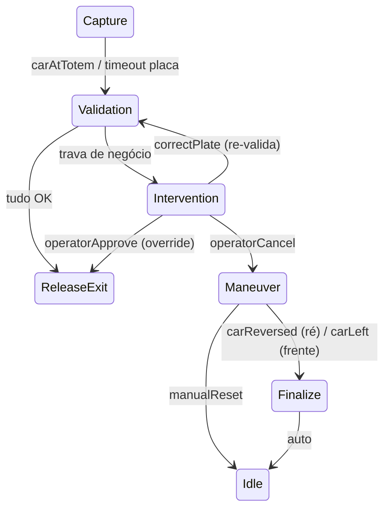

# LaneFlow — Tipos de veículo, fotos/placas e correção na intervenção

Data: 2026-05-29
Status: aprovado para planejamento
Depende de: backend laneflow + front em tempo real (já na `main`)

## 1. Objetivo

Modelar tipos de veículo (carro, caminhão, carreta+cavalo, moto) com suas placas frontal/traseira;
exibir no front um painel de **Veículo** com placas, fotos (placeholders) e dados da pessoa; e tornar a
**intervenção sempre resolúvel** — o operador corrige a placa (vista nas fotos / escolhida do registro)
re-validando a operação, ou **cancela → modo manobra** que evacua o veículo (nesta lane, **de ré**).

Inclui uma correção de arquitetura: introduzir uma **camada de use cases** (uma intenção por classe);
`LaneController` passa a ser um **adapter fino** (sem regra), e sinais de dispositivo entram por um
único use case de ingestão.

Idioma: código/commits em inglês; UI em português.

## 2. Domínio — tipos de veículo, placas e registro

```ts
export type VehicleType = "car" | "truck" | "rig" | "motorcycle";
export type PlatePosition = "front" | "rear";
export type VehicleUnit = "tractor" | "trailer";

export interface Plate {
  value: string;
  confidence: number;
  position: PlatePosition;
  unit?: VehicleUnit;          // rig: tractor (cavalo) / trailer (carreta)
  vehicleType: VehicleType;
  corrected?: boolean;          // true quando digitada pelo operador
}

export interface Person {
  id: string;
  name: string;
  registeredPlates: Plate[];    // N placas do cadastro
}
```

Composição de placas esperada por tipo (o quanto o ALPR emite):

| Tipo | Placas |
|---|---|
| `motorcycle` | 1 — traseira |
| `car` | 2 — frontal + traseira |
| `truck` | 2 — frontal + traseira |
| `rig` | 3 — cavalo frontal + cavalo traseira + carreta traseira (`unit`) |

- **Placa da operação** = a de **maior confiança** entre as lidas (getter `Operation.plate`, não-mutante).
- `Operation.vehicleType` = `vehicleType` da placa de maior confiança.
- Moto tem só traseira (mínimo 1 placa) — não quebra o fluxo.

`Person` muda o tipo de `registeredPlates` de `string[]` para `Plate[]`. `FakeBackendRecintos` passa a
guardar `Person` (com `registeredPlates`) e a comparação de `plateRegistered` é por `value`:
`registeredPlates.some(p => p.value === plate.value)`.

`ValidationService` não muda de lógica (pipeline igual); só consome o registro via `BackendPort`.

## 3. Flow — estado `Maneuver` + correção (sempre resolúvel)

### Novos eventos (`FlowEvent`)
- `correctPlate { value }` — operador digita a placa vista nas fotos.
- `operatorCancel` — cancela a operação → modo manobra.
- `carReversed` — sinal: carro saiu de ré.

### `Intervention.handle` (nunca trava)

| Evento | Próximo / efeito |
|---|---|
| `correctPlate { value }` | grava `{ value, confidence: 1, corrected: true, position: "front", vehicleType: op.vehicleType }` em `op.plates` → `transitionTo(Validation)` (re-roda o pipeline) |
| `operatorApprove` | `ReleaseExit` (override manual: libera sem re-checar) |
| `operatorCancel` | `Maneuver` |

### Novo estado `Maneuver`

- Config `LaneConfig.maneuverMode: "reverse" | "forward"`. Esta lane = `"reverse"`.
- `onEnter`: se `reverse` → `gates[op.side].open()` (abre a cancela de entrada do lado de origem); se
  `forward` → `gates.exit.open()`. Publica `maneuver { mode, side }`. Sem watchdog (operador conduz).
- `handle`:
  - `reverse`: `carReversed` → `Finalize`
  - `forward`: `carLeft` → `Finalize`
  - `manualReset` → `Idle` (escape extra)

### Diagrama (trecho atualizado)



Invariantes preservados: `Maneuver` abre **uma** cancela só (a do lado, em ré) — nunca duas de entrada
juntas; `Finalize`/`Idle` fecham tudo; correção reusa `Validation` (zero duplicação de regra).

## 4. Aplicação — use cases (intenções) + ingestão de sinais

```
src/application/use-cases/
  StartOperation.ts     execute(laneId, side)    iniciar acesso
  CorrectPlate.ts       execute(laneId, value)   corrigir placa (das fotos)
  ApproveRelease.ts     execute(laneId)          liberar (override)
  CancelOperation.ts    execute(laneId)          cancelar → manobra
  ResetLane.ts          execute(laneId)          reset técnico
  IngestLaneSignal.ts   execute(laneId, signal)  ingestão de sinal de dispositivo
```

- Cada use case = **uma intenção**: resolve a `Lane` (via `LaneRegistry`) e despacha o `FlowEvent`
  correspondente. É o lugar de guardas da intenção (ex.: `CorrectPlate` rejeita `value` vazio com erro).
- **Sinais de dispositivo** (confirmQueue, gateOpened, carInside, carAtTotem, carLeft, carReversed,
  plateRead, personDetected, weightMeasured) → `IngestLaneSignal`, que faz `flow.dispatch(signal)`.
- **`LaneController` vira adapter fino** (sem regra): mapeia `event.type` → use case.

```ts
switch (event.type) {
  case "startOperation": return startOperation.execute(laneId, event.side);
  case "correctPlate":   return correctPlate.execute(laneId, event.value);
  case "operatorApprove":return approveRelease.execute(laneId);
  case "operatorCancel": return cancelOperation.execute(laneId);
  case "manualReset":    return resetLane.execute(laneId);
  default:               return ingestSignal.execute(laneId, event);
}
```

Pilha:

```
LaneController (adapter HTTP→use case)
  └─ use-cases/ (intenções)  →  LaneFlow (process manager, stateful)
                                   ├─ ValidationService / EntryQueueService (domain services puros)
                                   └─ entidades (Operation, Gate, Plate, Person) + ports (infra emulada)
```

API/SSE inalterados (front segue postando `{ event }`); a distinção intenção × sinal vive no adapter.

## 5. Telemetria — adições

| Tópico | Origem | Payload |
|---|---|---|
| `maneuver` | Maneuver | `{ mode: "reverse"\|"forward", side: "A"\|"B" }` |

Tópicos existentes reaproveitados. `personDetected` (sinal) passa a carregar `registeredPlates` no
payload do evento (capturado pelo front via `command.received`). `command.received` continua sendo a
fonte das placas lidas e da pessoa para o front.

**Coerência da seed**: o `registeredPlates` enviado no `personDetected` (que o front exibe e de onde o
operador escolhe) e o registro consultado pela validação (`FakeBackendRecintos`) devem vir da **mesma
seed** no composition root, para que corrigir com uma placa do registro exibido realmente passe na
validação.

## 6. Front — painel Veículo, fotos, correção, cena de ré

### Estado de UI (reducer) — adições
- `plates: Plate[]` (todas as lidas) + `plate` (maior confiança, derivada) + `vehicleType`.
- `person: { id, name } | null` + `registry: Plate[]` (as N do cadastro), de `command.received{personDetected}`.
- estado `Maneuver` + `maneuver { mode, side }`. Reset em `Idle`.

### Painel "Veículo" (placeholders rotulados)
- Tipo do veículo (ícone + label).
- Uma "foto" por placa lida: caixa mock rotulada com a posição (`traseira`/`frontal`/`cavalo`/`carreta`,
  derivado de `position`+`unit`) e o **valor da placa sobreposto** (parece um crop) + confiança.
- Pessoa: avatar 👤 + nome/id + lista das **N placas do registro**.

### Painel de ação na `Intervention` (nunca travado)
- Motivo em destaque.
- **Corrigir placa**: input de texto + um botão por placa do registro (clicar preenche) → **Confirmar**
  envia `correctPlate { value }` (re-valida).
- **Liberar (override)** → `operatorApprove`.
- **Cancelar → manobra (ré)** → `operatorCancel`.

### Painel de ação no `Maneuver`
- "Modo manobra — ré pelo lado A/B". Botão **Confirmar saída de ré** → `carReversed`.

### Cena animada
- Emoji por tipo: 🚗 car · 🚚 truck · 🚛 rig · 🏍️ motorcycle.
- `maneuver` (reverse): o carro recua da eclusa para a fila de entrada do lado de origem (anima `left`
  de volta) e some.

### Cenários (controles)
- "Carro OK" (2 placas), "Moto OK" (1 traseira), "Carreta OK" (3 placas: cavalo+carreta),
  "Placa não detectada → corrigir" (sem `personDetected`/placa correta → `Intervention` → operador digita
  uma placa do registro), "Cancelar → ré" (trava → `operatorCancel` → `carReversed`).

## 7. Testes

- **Domínio**: `Plate`/`Person` novos campos; `Operation.vehicleType` da placa de maior confiança;
  `FakeBackendRecintos.plateRegistered` por `Plate[]`.
- **Flow**: `Intervention` → `correctPlate` re-valida → `ReleaseExit` quando a placa corrigida está no
  registro; `operatorCancel` → `Maneuver`; `Maneuver` (reverse) abre a cancela do lado e `carReversed` →
  `Finalize` → `Idle`. `operatorApprove` ainda libera (override).
- **Use cases**: cada um despacha o evento certo; `CorrectPlate` rejeita valor vazio; `IngestLaneSignal`
  repassa o sinal.
- **Adapter**: `LaneController` roteia `event.type` → use case correto (incl. default → ingestão).
- **Front (lógica pura)**: reducer captura `plates`/`person`/`registry`/`vehicleType`/`maneuver`; cenários
  com as sequências corretas.
- Cena/animação: validação manual no navegador.

## 8. Fora de escopo

- Detecção automática de tipo de veículo (aqui vem das placas/registro nos eventos).
- Fotos reais (placeholders apenas). Modo manobra `forward` (só `reverse` é exercido nesta lane).
- Persistência; múltiplas lanes na UI.
